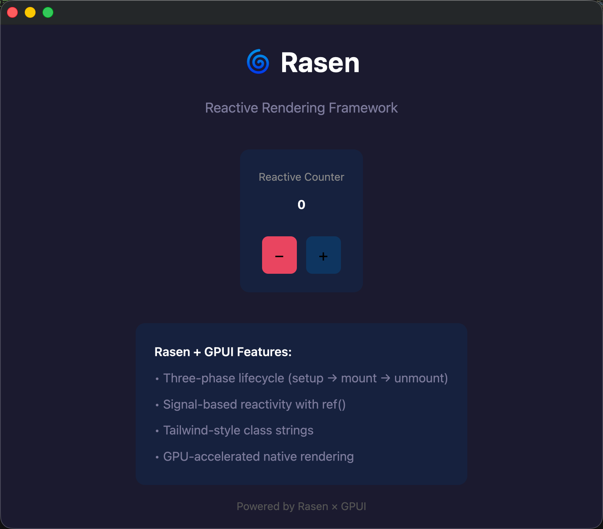
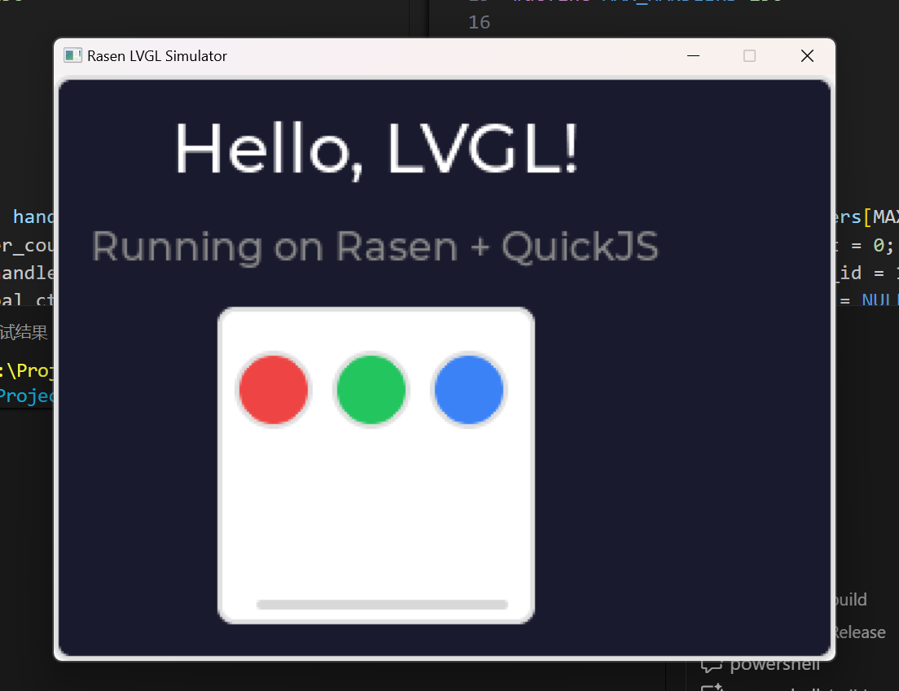
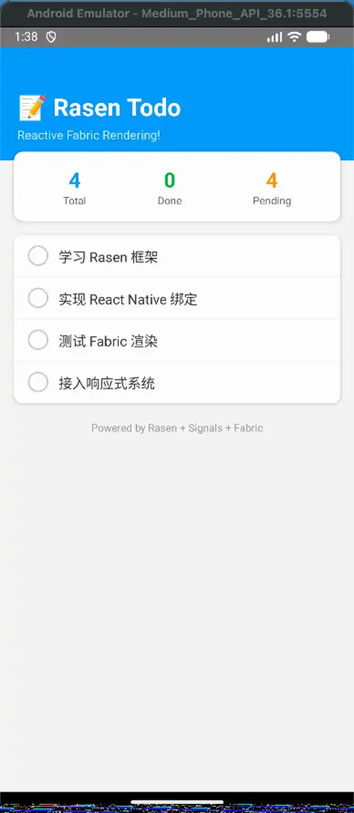

# 🌀 Rasen

<p align="center">
  
</p>

<p align="center">
  <strong>らせん (Spiral)</strong><br>
  <em>One Reactive Core, Multiple Render Targets</em><br><br>
  A reactive rendering framework agnostic to both reactive systems and rendering targets.<br>
  Write once, render to <b>DOM</b>, <b>Canvas 2D</b>, <b>React Native</b>, <b>SSR</b>, and more.
</p>

<p align="center">
  <a href="./docs/DESIGN.md"><strong>📖 Design Philosophy</strong></a> •
  <a href="#features">Features</a> •
  <a href="#packages">Packages</a> •
  <a href="#quick-start">Quick Start</a> •
  <a href="#cross-platform-examples">Cross-Platform</a> •
  <a href="#roadmap">Roadmap</a>
</p>

> 🚧 **Work In Progress**
>
> This framework is still under active development and has **NOT been published to npm**.
>
> **Please do not use this in production.** APIs are unstable and may change at any time.
>
> If you're interested in this project, feel free to ⭐ star and watch for updates!

## Features

- **Cross-Platform Rendering** - Same reactive logic, different render targets (DOM, Canvas, React Native)
- **Reactive System Agnostic** - Works with Vue, Signals, or any reactive library
- **Pure Function Components** - No virtual DOM, no component instances
- **Self-Controlled Rendering** - Components control their own rendering via watchers
- **JSX Support** - Optional JSX/TSX syntax with configurable tags
- **TypeScript First** - Full type safety and inference

## Packages

| Package                                                  | Description                                  |
| -------------------------------------------------------- | -------------------------------------------- |
| [@rasenjs/core](./packages/core)                         | Core runtime and type definitions            |
| [@rasenjs/dom](./packages/dom)                           | DOM rendering components                     |
| [@rasenjs/router](./packages/router)                     | Framework-agnostic router core               |
| [@rasenjs/router-dom](./packages/router-dom)             | DOM-specific router components               |
| [@rasenjs/canvas-2d](./packages/canvas-2d)               | Canvas 2D rendering components               |
| [@rasenjs/react-native](./packages/react-native)         | React Native Fabric renderer                 |
| [@rasenjs/gpui](./packages/gpui)                         | GPU-accelerated native desktop (Zed's GPUI)  |
| [@rasenjs/lvgl](./packages/lvgl)                         | Embedded UI for ESP32/STM32 (LVGL + QuickJS) |
| [@rasenjs/html](./packages/html)                         | HTML renderer for SSR/SSG                    |
| [@rasenjs/jsx-runtime](./packages/jsx-runtime)           | JSX/TSX runtime support                      |
| [@rasenjs/reactive-vue](./packages/reactive-vue)         | Vue 3 reactivity adapter                     |
| [@rasenjs/reactive-signals](./packages/reactive-signals) | TC39 Signals adapter                         |

## Quick Start

### Installation

```bash
# Core + DOM rendering + Vue reactivity
npm install @rasenjs/core @rasenjs/dom @rasenjs/reactive-vue vue

# Or with Signals
npm install @rasenjs/core @rasenjs/dom @rasenjs/reactive-signals signal-polyfill

# Optional: JSX support
npm install @rasenjs/jsx-runtime
```

### Basic Example

```typescript
import { setReactiveRuntime } from '@rasenjs/core'
import { createReactiveRuntime } from '@rasenjs/reactive-vue'
import { div, button, mount } from '@rasenjs/dom'
import { ref, computed } from 'vue'

// 1. Setup reactive runtime
setReactiveRuntime(createReactiveRuntime())

// 2. Create reactive state
const count = ref(0)

// 3. Define component
const Counter = () =>
  div({
    children: [
      div({ textContent: computed(() => `Count: ${count.value}`) }),
      button({
        textContent: 'Increment',
        on: { click: () => count.value++ }
      })
    ]
  })

// 4. Mount to DOM
mount(Counter(), document.getElementById('app'))
```

### With Router

```typescript
import { setReactiveRuntime } from '@rasenjs/core'
import { createReactiveRuntime } from '@rasenjs/reactive-signals'
import { createRouter, createBrowserHistory, route } from '@rasenjs/router'
import { createRouterView, createRouterLink } from '@rasenjs/router-dom'
import { div, mount } from '@rasenjs/dom'

// Setup reactive runtime
setReactiveRuntime(createReactiveRuntime())

// Define routes
const router = createRouter({
  home: route('/'),
  about: route('/about'),
}, {
  history: createBrowserHistory(),
})

// Create router components
const RouterView = createRouterView(router, {
  home: () => div({ textContent: 'Home Page' }),
  about: () => div({ textContent: 'About Page' }),
})

const Link = createRouterLink(router)

// App with navigation
const App = () => div({
  children: [
    Link({ to: router.routes.home, children: 'Home' }),
    Link({ to: router.routes.about, children: 'About' }),
    RouterView(),
  ]
})

mount(App(), document.getElementById('app'))
```

**Try the template with Router:**
```bash
npx degit rasenjs/rasen/templates/rasen-ts my-app
cd my-app
yarn install
yarn dev
```

## Cross-Platform Examples

Rasen's power lies in its ability to render to **any host** with the same reactive model:

### 🖥️ DOM

```typescript
import { div, button, mount } from '@rasenjs/dom'

const count = ref(0)

mount(
  div({
    children: [
      div({ textContent: computed(() => `Count: ${count.value}`) }),
      button({ textContent: '+', on: { click: () => count.value++ } })
    ]
  }),
  document.getElementById('app')
)
```

### 🎨 Canvas 2D

```typescript
import { canvas } from '@rasenjs/dom'
import { rect, text } from '@rasenjs/canvas-2d'

const x = ref(50)

mount(
  canvas({
    width: 400,
    height: 200,
    children: [
      rect({ x: x, y: 50, width: 100, height: 80, fill: '#4CAF50' }),
      text({ text: computed(() => `X: ${x.value}`), x: 10, y: 20 })
    ]
  }),
  document.getElementById('app')
)

// Animate
setInterval(() => (x.value = 50 + Math.sin(Date.now() / 500) * 100), 16)
```

### 📱 React Native (No React!)

```typescript
import { view, text, touchableOpacity } from '@rasenjs/react-native'

const count = ref(0)

view({
  style: { flex: 1, justifyContent: 'center', alignItems: 'center' },
  children: [
    text({
      style: { fontSize: 48 },
      children: computed(() => `${count.value}`)
    }),
    touchableOpacity({
      onPress: () => count.value++,
      children: text({ children: '+' })
    ]
  })
})
```

## Component Composition with `com`

For more complex components, use the `com` wrapper for automatic memory management and effect scope handling:

```typescript
import { com, getReactiveRuntime } from '@rasenjs/core'
import { div, button, input, ul, li, mount } from '@rasenjs/dom'

const TodoApp = com(() => {
  const runtime = getReactiveRuntime()
  const todos = runtime.ref([])
  const inputValue = runtime.ref('')
  
  return (host: HTMLElement) => {
    const addTodo = () => {
      if (inputValue.value.trim()) {
        todos.value = [...todos.value, inputValue.value]
        inputValue.value = ''
      }
    }
    
    // All watchers created here are automatically collected and cleaned up
    div({
      children: [
        input({
          placeholder: 'Enter task...',
          value: inputValue,
          on: { keypress: (e: KeyboardEvent) => e.key === 'Enter' && addTodo() }
        }),
        button({
          textContent: 'Add',
          on: { click: addTodo }
        }),
        ul({
          children: runtime.computed(() =>
            todos.value.map(todo =>
              li({
                textContent: todo,
                style: { padding: '8px', borderBottom: '1px solid #ddd' }
              })
            )
          )
        })
      ]
    })(host)
    
    // Cleanup is automatic - no memory leaks!
    return () => {}
  }
})

mount(TodoApp(), document.getElementById('app'))
```

### Benefits of `com`:

- **Memory Safety** - All effects are cleaned up automatically
- **Leak Prevention** - Critical for SPAs and mobile apps
- **Nested Components** - Proper cleanup order with parent/child relationships
- **Works Across Platforms** - Same component logic for DOM, Canvas, React Native, etc.

### 🖥️ Native Desktop (GPUI)

<p align="center">
  
</p>

```typescript
import { div, text, button, run } from '@rasenjs/gpui'
import { ref } from '@rasenjs/reactive-signals'

const App = () => {
  const count = ref(0)

  return div({
    class:
      'flex flex-col gap-4 bg-[#1a1a2e] size-full justify-center items-center',
    children: [
      text({ class: 'text-4xl text-white', children: '🌀 Rasen GPUI' }),
      text({ class: 'text-5xl text-white', children: count }), // reactive!
      div({
        class: 'flex gap-3',
        children: [
          button({
            class: 'px-4 py-2 bg-[#e94560] rounded-lg',
            onClick: () => count.value--,
            children: [text({ children: '−' })]
          }),
          button({
            class: 'px-4 py-2 bg-[#0f3460] rounded-lg',
            onClick: () => count.value++,
            children: [text({ children: '+' })]
          })
        ]
      })
    ]
  })
}

run(App) // GPU-accelerated native window!
```

### 🔌 Embedded Devices (LVGL + QuickJS)

<p align="center">
  
</p>

Run Rasen on ESP32, STM32 and other embedded devices with LVGL graphics library:

```typescript
// Works on ESP32-C6, STM32, or desktop simulator!
function App() {
  var count = ref(0)
  
  return div({
    class: 'flex flex-col items-center justify-center size-full bg-gray-900 gap-4',
    children: [
      label({
        class: 'text-2xl text-white',
        children: function() { return 'Count: ' + count.value }
      }),
      div({
        class: 'flex flex-row gap-2',
        children: [
          button({
            class: 'px-4 py-2 bg-blue-500 rounded-lg',
            onClick: function() { count.value-- },
            children: [label({ class: 'text-white', children: '-' })]
          }),
          button({
            class: 'px-4 py-2 bg-blue-500 rounded-lg',
            onClick: function() { count.value++ },
            children: [label({ class: 'text-white', children: '+' })]
          })
        ]
      })
    ]
  })
}

run(App)
```

**Setup for LVGL development:**

```bash
cd packages/lvgl

# 1. Download dependencies (LVGL, QuickJS-ng, SDL2)
pnpm setup

# 2. Build simulator (Windows/macOS/Linux)
cd native/simulator
mkdir build && cd build
cmake ..
cmake --build . --config Release

# 3. Run your app
./Release/rasen_simulator your-app.js
```

### 📄 Server-Side Rendering (SSR)

```typescript
import { renderToString, div, p, ul, li } from '@rasenjs/html'

// No reactive runtime needed for SSR!
const html = renderToString(
  div(
    { class: 'container' },
    p({ class: 'title' }, 'Hello from SSR!'),
    ul({ class: 'list' }, li('Item 1'), li('Item 2'), li('Item 3'))
  )
)
// Output: <div class="container"><p class="title">Hello from SSR!</p><ul class="list"><li>Item 1</li>...</ul></div>
```

### With JSX

```tsx
// tsconfig.json: { "jsx": "react-jsx", "jsxImportSource": "@rasenjs/jsx-runtime" }

const Counter = () => {
  const count = ref(0)
  return (
    <div>
      <p>Count: {count}</p>
      <button onClick={() => count.value++}>Increment</button>
    </div>
  )
}
```

## Examples

```bash
# Run web examples
yarn examples:dev
```

See [examples/](./examples) for complete demos:

- **Web** ([examples/web](./examples/web)) - DOM, Canvas 2D, JSX demos
- **React Native** ([examples/react-native](./examples/react-native)) - Mobile app without React

## Preview

Here is an animated preview from the React Native demo:

<p align="center">
  
  <br/>
  <em>If the animation doesn't play in your viewer, open it on GitHub or a browser.</em>
</p>

## Roadmap

### Render Targets

| Target         | Status         | Description                           |
| -------------- | -------------- | ------------------------------------- |
| DOM            | 🚧 In Progress | Browser DOM rendering                 |
| Canvas 2D      | 🚧 In Progress | 2D graphics & animations              |
| React Native   | 🚧 In Progress | Mobile apps via Fabric (no React)     |
| HTML (SSR/SSG) | 🚧 In Progress | Server-side rendering to HTML strings |
| Three.js       | 📋 Planned     | 3D graphics & WebGL                   |

### Compilers & Tooling

| Tool             | Status     | Description                                 |
| ---------------- | ---------- | ------------------------------------------- |
| SFC Compiler     | 📋 Planned | Single File Components with static hoisting |
| Mini Program SFC | 📋 Planned | WeChat/Alipay mini program support          |

### Legend

- ✅ Complete
- 🚧 In Progress
- 📋 Planned

## Documentation

Each package has detailed documentation:

- **[Core Concepts](./packages/core/README.md)** - Component model, lifecycle, reactive runtime
- **[DOM Rendering](./packages/dom/README.md)** - DOM components and mounting
- **[Canvas 2D](./packages/canvas-2d/README.md)** - 2D graphics rendering
- **[React Native](./packages/react-native/README.md)** - Fabric architecture binding
- **[HTML/SSR](./packages/html/README.md)** - Server-side rendering to HTML strings
- **[JSX Runtime](./packages/jsx-runtime/README.md)** - JSX configuration and usage
- **[Vue Adapter](./packages/reactive-vue/README.md)** - Vue 3 reactivity integration
- **[Signals Adapter](./packages/reactive-signals/README.md)** - TC39 Signals integration

## Architecture

```
┌─────────────────────────────────────────────────────────────────────┐
│                         Your Application                            │
├─────────────────────────────────────────────────────────────────────┤
│                 @rasenjs/jsx-runtime (optional)                      │
├───────────────┬────────────────┬──────────────────┬─────────────────┤
│ @rasenjs/dom  │@rasenjs/canvas │@rasenjs/react-   │  @rasenjs/html  │
│               │     -2d        │    native        │   (SSR/SSG)     │
│               │                │                  │                 │
├───────────────┴────────────────┴──────────────────┴─────────────────┤
│                          @rasenjs/core                               │
├─────────────────────────────────────────────────────────────────────┤
│      @rasenjs/reactive-vue     |     @rasenjs/reactive-signals       │
│                       (Reactive Adapters)                            │
└─────────────────────────────────────────────────────────────────────┘
```

## Development

```bash
# Install dependencies
yarn install

# Build all packages
yarn build

# Run tests
yarn test

# Type check
yarn typecheck

# Lint
yarn lint
```

## Project Structure

```
rasen/
├── packages/
│   ├── core/              # Core runtime
│   ├── dom/               # DOM renderer
│   ├── canvas-2d/         # Canvas 2D renderer
│   ├── react-native/      # React Native renderer
│   ├── html/              # HTML renderer (SSR/SSG)
│   ├── jsx-runtime/       # JSX support
│   ├── reactive-vue/      # Vue adapter
│   └── reactive-signals/  # Signals adapter
├── examples/
│   ├── web/               # Web examples
│   └── react-native/      # RN example app
└── ...
```

## License

MIT © Rasen Contributors
