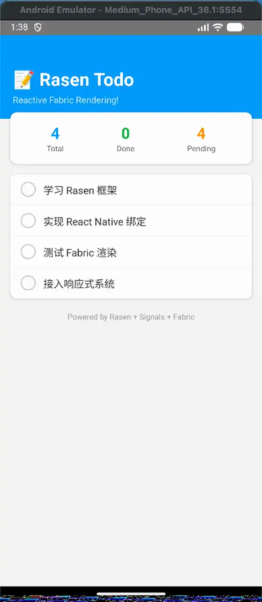

# @rasenjs/react-native

React Native Fabric renderer for the Rasen reactive rendering framework.

**Directly calls React Native's Fabric architecture APIs without using React.**

## Preview

<p align="center">
  
  <br/>
  <em>If the animation doesn't play in your viewer, open it on GitHub or a browser.</em>
</p>

## Installation

```bash
npm install @rasenjs/react-native @rasenjs/core
```

## Overview

`@rasenjs/react-native` provides a way to build React Native apps using Rasen's reactive rendering model, bypassing React entirely and directly interfacing with the Fabric architecture.

## Features

- **Direct Fabric API** - Binds to React Native's new architecture
- **No React Dependency** - Operates without React reconciler
- **Reactive Driven** - Seamlessly integrates with Rasen's reactive system
- **Type Safe** - Full TypeScript support
- **High Performance** - Direct native view manipulation, no virtual DOM

## Prerequisites

- React Native >= 0.72.0 (New Architecture)
- Fabric renderer enabled

## Quick Start

### 1. Setup Reactive Runtime

```typescript
import { useReactiveRuntime } from '@rasenjs/reactive-vue'

useReactiveRuntime()
```

### 2. Create Components

```typescript
import { view, text, touchableOpacity } from '@rasenjs/react-native'
import { ref, computed } from '@vue/reactivity'

const count = ref(0)

const Counter = view({
  style: {
    flex: 1,
    justifyContent: 'center',
    alignItems: 'center'
  },
  children: [
    text({
      style: { fontSize: 48, fontWeight: 'bold' },
      children: count  // Reactive binding
    }),
    touchableOpacity({
      style: {
        backgroundColor: '#007AFF',
        padding: 16,
        borderRadius: 8,
        marginTop: 20
      },
      onPress: () => count.value++,
      children: [
        text({
          style: { color: 'white', fontSize: 18 },
          children: 'Increment'
        })
      ]
    })
  ]
})
```

### 3. Mount Application

```typescript
import { AppRegistry } from 'react-native'
import { mount } from '@rasenjs/react-native'

AppRegistry.registerRunnable('MyApp', ({ rootTag }) => {
  mount(Counter, rootTag)
  return { run: () => {} }
})
```

## Components

### View

Container component with flexbox layout.

```typescript
import { view } from '@rasenjs/react-native'

view({
  style: {
    flex: 1,
    flexDirection: 'row',
    justifyContent: 'center',
    alignItems: 'center',
    backgroundColor: '#f5f5f5',
    padding: 20,
    gap: 10
  },
  children: [/* child components */]
})
```

### Text

Text display component.

```typescript
import { text } from '@rasenjs/react-native'

text({
  style: {
    fontSize: 16,
    fontWeight: 'bold',
    color: '#333',
    textAlign: 'center'
  },
  children: 'Hello World'
})

// Reactive text
text({
  children: computed(() => `Count: ${count.value}`)
})
```

### TouchableOpacity

Touchable component with opacity feedback.

```typescript
import { touchableOpacity, text } from '@rasenjs/react-native'

touchableOpacity({
  style: {
    backgroundColor: '#007AFF',
    padding: 12,
    borderRadius: 8
  },
  onPress: () => console.log('Pressed!'),
  activeOpacity: 0.7,
  children: [
    text({ children: 'Press Me' })
  ]
})
```

### TextInput

Text input component.

```typescript
import { textInput } from '@rasenjs/react-native'

const inputValue = ref('')

textInput({
  style: {
    borderWidth: 1,
    borderColor: '#ccc',
    padding: 12,
    borderRadius: 8
  },
  value: inputValue,
  placeholder: 'Enter text...',
  onChangeText: (text) => inputValue.value = text
})
```

### ScrollView

Scrollable container.

```typescript
import { scrollView, view } from '@rasenjs/react-native'

scrollView({
  style: { flex: 1 },
  contentContainerStyle: { padding: 20 },
  children: [
    // Scrollable content
  ]
})
```

### Image

Image display component.

```typescript
import { image } from '@rasenjs/react-native'

image({
  source: { uri: 'https://example.com/image.png' },
  style: { width: 200, height: 200 },
  resizeMode: 'cover'
})
```

### Pressable

Pressable with `pressed` state, function styles, and Android ripple support.

```typescript
import { pressable, text } from '@rasenjs/react-native'

pressable({
  style: ({ pressed }) => ({
    backgroundColor: pressed ? '#007AFF' : '#ccc',
    opacity: pressed ? 0.8 : 1
  }),
  onPress: () => console.log('Pressed!'),
  android_ripple: { color: '#ffffff' },
  children: [
    text({ children: 'Press Me' })
  ]
})
```

### Button

Native-style button (Android: filled background + uppercase title; iOS: tinted text).

```typescript
import { button } from '@rasenjs/react-native'

button({
  title: 'Submit',
  color: '#007AFF',
  onPress: () => console.log('Submitted!'),
  disabled: false
})
```

### TouchableHighlight / TouchableWithoutFeedback

```typescript
import { touchableHighlight, touchableWithoutFeedback, text } from '@rasenjs/react-native'

touchableHighlight({
  underlayColor: '#ddd',
  activeOpacity: 0.85,
  onPress: () => console.log('Highlighted!'),
  children: [text({ children: 'Highlight' })]
})

touchableWithoutFeedback({
  onPress: () => console.log('No feedback'),
  children: [text({ children: 'Plain' })]
})
```

### SafeAreaView

Safe-area container (iOS notch/pill insets).

```typescript
import { safeAreaView, text } from '@rasenjs/react-native'

safeAreaView({
  style: { flex: 1 },
  children: [text({ children: 'Safe content' })]
})
```

### ImageBackground

View with an absolute-fill background image and layered children.

```typescript
import { imageBackground, text } from '@rasenjs/react-native'

imageBackground({
  source: { uri: 'https://example.com/bg.png' },
  style: { flex: 1 },
  imageStyle: { opacity: 0.5 },
  children: [text({ children: 'Overlay' })]
})
```

### KeyboardAvoidingView

Container that avoids the on-screen keyboard (padding behavior).

```typescript
import { keyboardAvoidingView, textInput } from '@rasenjs/react-native'

keyboardAvoidingView({
  behavior: 'padding',
  keyboardVerticalOffset: 60,
  children: [textInput({ placeholder: 'Type here' })]
})
```

### StatusBar

Configurator component (pushes an entry on mount, pops on unmount).

```typescript
import { statusBar } from '@rasenjs/react-native'

statusBar({
  barStyle: 'light-content',
  backgroundColor: '#000000'
})
```

### FlatList

Reactive scrollable list.

```typescript
import { flatList, text } from '@rasenjs/react-native'
import { ref } from '@vue/reactivity'

const todos = ref([
  { id: 1, title: 'Learn Rasen' },
  { id: 2, title: 'Build an app' }
])

flatList({
  data: todos,
  keyExtractor: (item) => String(item.id),
  renderItem: ({ item }) => text({ children: item.title }),
  ListHeaderComponent: () => text({ children: 'TODO' }),
  ItemSeparatorComponent: () => text({ children: '\n' }),
  onEndReached: () => console.log('Reached the end!')
})
```

## Testing

The package ships a Vitest-based test infrastructure (mirroring `rn-dom` and
`vue-rn`):

```bash
yarn workspace @rasenjs/react-native test
```

- `vitest.config.ts` — aliases `@rasenjs/rn-dom` to its source
- `src/__tests__/setup.ts` — mocks `react-native`, `ReactNativePrivateInterface`,
  `@rasenjs/rn-dom/elements`, and the Fabric UIManager; installs the Vue
  reactive runtime
- `src/__tests__/render-helper.ts` — `mountComponent()` + press-event helpers
  (`firePress`, `firePressIn`, `firePressOut`) for asserting on the Fabric
  node tree

```typescript
import { mountComponent, nodeProps, firePress } from '../__tests__/render-helper'

const { root } = mountComponent((p) => Pressable({ onPress, ...p }))
firePress(root)
expect(onPress).toHaveBeenCalledTimes(1)
```

## Metro Plugin

`@rasenjs/react-native/metro` wraps all the Metro config a Rasen RN app needs
(JSX runtime redirection + single-instance resolution) into one line:

```js
// metro.config.js
const { getDefaultConfig } = require('@react-native/metro-config')
const { withRasenRN } = require('@rasenjs/react-native/metro')

module.exports = withRasenRN(getDefaultConfig(__dirname))
```

What it does:
- Redirects `react/jsx-runtime` / `react/jsx-dev-runtime` to
  `@rasenjs/react-native/jsx-runtime` (Rasen renders without React)
- Forces a single module instance for `@rasenjs/*` packages (avoids the
  `import`/`require` split that would duplicate module-level state)
- Adds the rasen package roots to `watchFolders` and `mjs` to `sourceExts`

## Babel Plugin (Metro HMR)

`@rasenjs/react-native/babel` injects rasen's HMR runtime calls into component
files for Metro (which uses `module.hot.accept()`, unlike Vite):

```js
// babel.config.js
module.exports = {
  presets: ['module:@react-native/babel-preset'],
  plugins: [
    ['@rasenjs/react-native/babel', { hmr: true }],
  ],
}
```

Only files that call `com()` (rasen's component wrapper) are injected, so
plain utility modules are untouched.

## DevTools

A lightweight remote debugger for Rasen RN apps (node tree + render
performance), served over socket.io.

```bash
# 1. Start the devtools server (default port 8099)
npx rasen-devtools
# PORT=9000 npx rasen-devtools

# 2. In the app (__DEV__ only), before registerApp():
if (__DEV__) {
  const { connectRasenDevTools } = require('@rasenjs/react-native/devtools')
  connectRasenDevTools() // host: http://localhost (iOS sim) / 10.0.2.2 (Android emu)
}

# 3. Open http://localhost:8099/ in a browser
```

Features:
- **Node Tree** — the live rn-dom node tree (tag, testID, style keys)
- **Render Performance** — per-tag render count / total / max time

The instrumentation hook is installed by `connectRasenDevTools()`; `element()`
calls it around each mount with zero overhead when the devtools aren't
connected.

## Reactive Props

All props support reactive values:

```typescript
const isActive = ref(false)
const count = ref(0)

view({
  style: computed(() => ({
    backgroundColor: isActive.value ? '#007AFF' : '#ccc',
    opacity: isActive.value ? 1 : 0.5
  })),
  children: [
    text({
      children: computed(() => `Count: ${count.value}`)
    })
  ]
})
```

## Style Props

React Native style properties are fully supported:

```typescript
{
  // Layout
  flex: 1,
  flexDirection: 'row' | 'column',
  justifyContent: 'flex-start' | 'center' | 'flex-end' | 'space-between',
  alignItems: 'flex-start' | 'center' | 'flex-end' | 'stretch',
  gap: 10,
  
  // Spacing
  padding: 20,
  paddingHorizontal: 10,
  paddingVertical: 15,
  margin: 10,
  
  // Sizing
  width: 100,
  height: 100,
  minWidth: 50,
  maxHeight: 200,
  
  // Visual
  backgroundColor: '#fff',
  borderRadius: 8,
  borderWidth: 1,
  borderColor: '#ccc',
  opacity: 0.5,
  
  // Position
  position: 'relative' | 'absolute',
  top: 0,
  left: 0,
  right: 0,
  bottom: 0,
  zIndex: 10
}
```

## Architecture

Rasen bypasses React entirely and directly interfaces with React Native's Fabric architecture at the lowest available JavaScript layer.

### How React Native Works (with React)

```
┌─────────────────────────────────────────────────────────────┐
│                     React Application                        │
│                  (JSX → React Elements)                      │
├─────────────────────────────────────────────────────────────┤
│                    React Reconciler                          │
│              (Fiber, Diff, Scheduling)                       │
├─────────────────────────────────────────────────────────────┤
│                      ReactFabric                             │
│         (Compiled bundle with HostConfig impl)               │
│    ┌─────────────────────────────────────────────────────┐  │
│    │  Internally uses:                                    │  │
│    │  - nativeFabricUIManager (C++ bindings)             │  │
│    │  - ReactNativePrivateInterface (JS utilities)       │  │
│    └─────────────────────────────────────────────────────┘  │
├─────────────────────────────────────────────────────────────┤
│                   Fabric C++ Core                            │
│       (Shadow Tree, Yoga Layout, Native Views)               │
└─────────────────────────────────────────────────────────────┘
```

### How Rasen Works (without React)

```
┌─────────────────────────────────────────────────────────────┐
│                   Rasen Application                          │
│             (Component Functions → Instances)                │
├─────────────────────────────────────────────────────────────┤
│  @rasenjs/reactive-*    │           @rasenjs/react-native   │
│  (Signal System)        │           (Fabric Renderer)       │
│                         │                                    │
│  - signal-polyfill      │    ┌──────────────────────────┐   │
│  - @preact/signals      │    │ Direct API Access:       │   │
│  - Vue reactivity       │    │                          │   │
│                         │    │ nativeFabricUIManager    │   │
│                         │    │   - createNode()         │   │
│                         │    │   - appendChild()        │   │
│                         │    │   - cloneNodeWithNewProps│   │
│                         │    │   - setNativeProps()     │   │
│                         │    │   - completeRoot()       │   │
│                         │    │                          │   │
│                         │    │ ReactNativePrivateInterface│  │
│                         │    │   - ViewConfigRegistry   │   │
│                         │    │   - createAttributePayload│  │
│                         │    │   - createPublicInstance │   │
│                         │    └──────────────────────────┘   │
├─────────────────────────────────────────────────────────────┤
│                   Fabric C++ Core                            │
│       (Shadow Tree, Yoga Layout, Native Views)               │
└─────────────────────────────────────────────────────────────┘
```

### Why This Approach?

| Layer | React's Usage | Rasen's Access | Notes |
|-------|---------------|----------------|-------|
| `ReactFabric` | Entry point (`render()`) | ❌ Cannot use | Requires React Elements |
| `ReactFiberConfigFabric` | Internal HostConfig | ❌ Not exported | Compiled into ReactFabric bundle |
| `nativeFabricUIManager` | Used internally | ✅ Direct access | Global C++ binding |
| `ReactNativePrivateInterface` | Used internally | ✅ Direct access | Exported JS utilities |

**Key insight**: React's HostConfig implementation (`ReactFiberConfigFabric.js`) is compiled into `ReactFabric-prod.js` and not separately exported. We access the same underlying APIs that React uses:

- `nativeFabricUIManager` - C++ bindings injected as global variable
- `ReactNativePrivateInterface` - JS utility module from `react-native`

This allows Rasen to drive native UI updates using **Signal-based reactivity** instead of React's reconciler.

## Notes

- This package uses `AppRegistry.registerRunnable()` instead of `registerComponent()`
- UI rendering is managed by Rasen's render context
- The current implementation requires native module support for full Fabric integration
- See [examples/react-native](../../examples/react-native) for a complete example

## License

MIT
