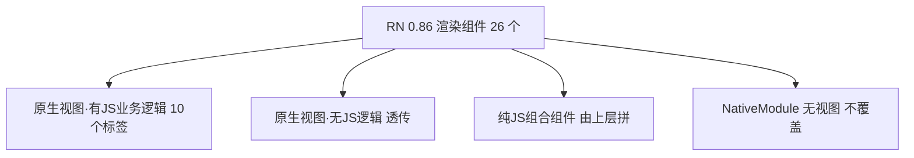

# rn-dom ↔ React Native 0.86 对齐记录

> 本文档记录 @rasenjs/rn-dom(基于 RN Fabric 的 DOM-like 视图层)与
> React Native 0.86 的组件对齐状态。维护/扩展组件时先读这里。
>
> RN 源码根:`examples/vue-rn-test/node_modules/react-native/`
> 审计日期:2026-08-03

---

## 1. 设计定位:为什么 rn-dom 只有这些标签

rn-dom 是**原生视图层**抽象(直接映射 Fabric ViewManager),不是完整 RN 组件库。
RN 0.86 导出的渲染组件分四类,rn-dom 只对"有 RN JS 层业务逻辑的原生视图"建专属类:

| 分类 | 说明 | rn-dom 处理 |
|---|---|---|
| **原生视图 + JS 业务逻辑** | 有 prop 转换/受控/事件/children 结构包装 | 专属节点类(`src/elements/*.ts`) |
| **原生视图,无 JS 逻辑** | 透传即可(原生端处理) | 注册进 `RN_BUILT_IN_TAGS` + `RNViewElement` 透传 |
| **纯 JS 组合组件** | 用基础原生拼(FlatList/Button/ImageBackground/KeyboardAvoidingView) | 不实现,由 vue-rn 用积木拼(wrapper) |
| **NativeModule 无视图** | StatusBar/ToastAndroid 等 | DOM 抽象天然不覆盖 |

> RN 0.86 里组件默认值**不在 normalizeProps 函数**,而在 codegen spec 的
> `WithDefault` + JS 参数默认。rn-dom 直接映射原生(没有 RN 组件层),故在
> 各元素类的 `__RN_normalizeProps` 里**复刻默认值**。

---

## 2. 标签清单(elements.cjs `RN_BUILT_IN_TAGS`)

24 个内置标签;`SPECIAL_CLASSES`(registry.ts)标注了有专属业务逻辑的类:

| 标签 | 节点类 | 说明 |
|---|---|---|
| `View` | RNViewElement(基类) | 透传 + applyAria |
| `SafeAreaView` | RNViewElement | 透传(iOS 原生处理安全区;Android 是普通 View) |
| `Text` | RNTextElement | accessible 平台默认/link role/numberOfLines 校验/userSelect/ellipsizeMode |
| `Image` | RNImageElement | source 数组化/srcSet/crossOrigin/resizeMode/alt-aria |
| `TextInput` / `AndroidTextInput` | RNTextInputElement | value→text/受控回写/外层映射表/submitBehavior |
| `ScrollView` / `AndroidHorizontalScrollView` | RNScrollViewElement | content container 包装/sticky header/tap-to-dismiss 联动 |
| `ActivityIndicator` | RNActivityIndicatorElement | 两节点容器(外 RCTView + 内 spinner) |
| `ProgressBarAndroid` | RNProgressBarAndroidElement | styleAttr/indeterminate/animating 默认值 |
| `Switch` / `AndroidSwitch` | RNSwitchElement | value→on/trackColor 拆分/受控/accessibilityRole |
| `RefreshControl` / `AndroidSwipeRefreshLayout` | RNRefreshControlElement | refreshing 受控(setNativeRefreshing)/topRefresh |
| `Modal` | RNModalElement | 容器 View/identifier/visible 透传/confirmProps |
| `DrawerLayoutAndroid` | RNDrawerLayoutAndroidElement | 双 wrapper/事件/命令/默认值 |
| `Pressable`/`TouchableOpacity`/`TouchableHighlight`/`TouchableWithoutFeedback`/`TouchableNativeFeedback` | RNViewElement(透传) | →RCTView + 事件系统 press 合成 |
| `DebuggingOverlay` | RNViewElement | dev 工具 |
| `InputAccessoryView` | RNViewElement(透传) | iOS 专属(RCTInputAccessoryView);Android 无 |

### 每个标签的 RN 源码位置

| 标签 | RN 源码(相对 node_modules/react-native/) |
|---|---|
| View | `Libraries/Components/View/View.js` |
| Text | `Libraries/Text/Text.js` |
| TextInput | `Libraries/Components/TextInput/TextInput.js` |
| Image | `Libraries/Image/Image.android.js` / `Image.ios.js` |
| ScrollView | `Libraries/Components/ScrollView/ScrollView.js` |
| ActivityIndicator | `Libraries/Components/ActivityIndicator/ActivityIndicator.js` |
| Switch | `Libraries/Components/Switch/Switch.js` |
| RefreshControl | `Libraries/Components/RefreshControl/RefreshControl.js` |
| Modal | `Libraries/Modal/Modal.js` |
| DrawerLayoutAndroid | `Libraries/Components/DrawerAndroid/DrawerLayoutAndroid.android.js` |
| ProgressBarAndroid | `Libraries/Components/ProgressBarAndroid/ProgressBarAndroid.android.js` |

---

## 3. 已对齐的关键业务逻辑(摘要)

### 通用
- **aria 转换**(`src/elements/shared.ts` `applyAria`):`aria-label→accessibilityLabel`、
  `aria-labelledby→数组`、`aria-live(off→none)`、`aria-hidden→accessibilityElementsHidden
  +importantForAccessibility`、`id→nativeID`、`tabIndex→focusable=!tabIndex`、
  `aria-state/value→accessibilityState/Value`。基类 `__RN_normalizeProps` 默认走它。

### Text
- accessible 平台默认(iOS `!==false`;Android 仅按压时可访问)、pressable→`role='link'`、
  `numberOfLines<0→0`、`id→nativeID`、`userSelect→selectable`(contain=true)、
  `verticalAlign→textAlignVertical`、`fontWeight` 数字→字符串。

### TextInput
- `value→text`(value 不在原生 validAttributes)、`defaultValue` 也触发受控回写、
  `value`+children 互斥 throw、selection `end ?? start` 归一 + 受控回写、
  外层映射 4 表(`enterKeyHint→returnKeyType`/`inputMode→keyboardType`/
  `autoComplete` Android/iOS)、`readOnly→editable`、`submitBehavior` 推导、
  iOS multiline→RCTMultilineTextInputView + 默认 paddingTop:5、
  `accessible!==false`、`tabIndex→focusable`、`caretHidden`(isTesting)。

### Image
- `source` 统一数组化、`srcSet` 拆档、`src→{uri}`、`crossOrigin/referrerPolicy→headers`、
  `resizeMode=objectFit??prop??style??'cover'`、单源固有宽高、
  `defaultSource+loadingIndicatorSource` 互斥 warn、Android `shouldNotifyLoadEvents`/
  `defaultSource→uri`/`loadingIndicatorSrc`、alt 链 aria、`<Image>` 禁 children(throw)。

### Switch
- `value→on`、`trackColor` 拆分、`thumbColor→thumbTintColor`、Android 剥离 iOS 专属、
  iOS 无条件 base `alignSelf:'flex-start'` + `ios_backgroundColor` 烘焙、
  `accessibilityRole='switch'`、responder 注入、disabled 回退 accessibilityState +
  平台重写、受控 setValue/setNativeValue。

### ScrollView
- content container 包装(RN 单子语义,规避 Fabric append 崩溃)、baseStyle、
  `decelerationRate` 平台值、pagingEnabled/snapTo 推导、`keyboardShouldPersistTaps`
  boolean→string、`removeClippedSubviews`(Android+sticky→false)/
  `collapsableChildren`、Android `keyboardDismissMode='on-drag'`→Keyboard.dismiss、
  **sticky header**(topScroll 驱动 + wrapper + setNativeProps,无 Animated)、
  onContentSizeChange(content container onLayout)。

### ActivityIndicator
- 两节点容器:元素 = 外层 RCTView(居中),`__RN_buildChildren` 建内层
  RCTActivityIndicatorView/AndroidProgressBar。需 `__RN_alwaysBuildChildren` 标记。

### Modal
- **组件名双名**:viewConfigRegistry 键 `RCTModalHostView`(JS paper 名),Fabric C++ 名
  `ModalHostView`(codegen 名)。`ensure()` 返回前者查 viewConfig;`__RN_resolveNativeName()`
  hook 映射成后者 createNode —— 否则 C++ 走 fallback descriptor(无 Dialog/全屏)。
- **children 直接挂 ModalHostView(无容器)**:ModalHostView 是 RootNodeKind(子树独立布局,
  约束来自 C++ screenSize state),其子树内 rn-dom 直接 createNode 的内部节点 style 在原生
  完全不被应用(实测 0 高)→ 容器 View 无法工作。children 直接挂则正常全屏(等同 RN
  transparent Modal 语义,用户内容自设背景)。
- `identifier` 注入(modalDismissed 路由)、visible 默认 true 透传原生、`__DEV__`
  confirmProps 3 警告。
- **Android visible 控制**:原生 setVisible 是 no-op(Dialog 由 showOrUpdate 无条件显示),
  visible=false 必须卸载 ModalHostView(由 vue-rn Modal wrapper 在 Android 返回 null);
  iOS 始终挂载(visible 透传原生 + 退场动画)。

### RefreshControl
- `refreshing` 受控:JS 变化靠 props diff(仅记录 `_lastNativeRefreshing`);
  `topRefresh` 时置 true→调 onRefresh→若用户未 setState(true) 则
  `setNativeRefreshing(false)` 强制回退。平台 prop 剔除 + 默认值。

### DrawerLayoutAndroid
- 双 wrapper(主内容绝对铺满 + 抽屉 width/backgroundColor/pointerEvents 随开合)、
  **DOM 映射约定:children[0]=navigationView,其余=主内容**(RN 的
  renderNavigationView 是函数 prop,DOM 无法表达)、`topDrawer*` 事件映射、
  `openDrawer/closeDrawer` 命令、默认值。

### 事件/命令体系
- **hook 全貌**(RNNode 默认实现,子类 override):
  `__RN_normalizeProps` / `__RN_handleNativeEvent` / `__RN_buildChildren` /
  `__RN_resolveNativeName` / `__RN_syncControlledProp` / `__RN_preparePayload` /
  `__RN_alwaysBuildChildren`。
- 受控回写:`setTextAndSelection`(TextInput)/`setValue`/`setNativeValue`(Switch)/
  `setNativeRefreshing`(RefreshControl),带 eventCount 竞态防护。
- 命令导出(index.ts):`measure/clear/setSelection/setSwitchValue/scrollToEnd/
  flashScrollIndicators/zoomToRect/openDrawer/closeDrawer`。
- 事件分发:`createDispatcher`(capture→target→bubble)、press 合成(drivePress)、
  tap-to-dismiss(keyboardShouldPersistTaps 三分支)。

---

## 4. 剩余不对齐项(架构/未做)

| 项 | 说明 | 原因/状态 |
|---|---|---|
| **ScrollView `refreshControl` 槽** | iOS:RefreshControl 内嵌为 ScrollView 直接 child;Android:**外层包裹**(cloneElement + style 拆分 + `nestedScrollEnabled` 强制 true) | RefreshControl 元素类已就绪;槽需 vue-rn 设计传法(prop vs slot) |
| **FlatList / SectionList / VirtualizedList** | 纯 JS 虚拟化(`@react-native/virtualized-lists`),最终渲染 ScrollView+RCTView cell | 归属未定(rn-dom 提供 List 节点 vs vue-rn 用 ScrollView 组合);大工程 |
| **StatusBar** | `render()` 返回 null,全走 StatusBarManager TurboModule | NativeModule 无视图,DOM 不覆盖;需 vue-rn wrapper |
| **TouchableNativeFeedback ripple** | Android 原生 drawable(ripple) | 需 NativeDrawableHelper,架构复杂;作为 RCTView+press 合成,ripple 不支持 |
| **KeyboardAvoidingView / Button / ImageBackground** | 纯 JS 组合 | vue-rn 已有 wrapper(Button/KeyboardAvoidingView/ImageBackground)✓ |
| **Text nested 检测** | RN 用 TextAncestorContext | rn-dom 直接 `parentNode.tagName==='Text'`(无组件边界,更精确)✓ 无需改 |
| **事件顺序** | onChangeText/onValueChange 先于 onChange | rn-dom 当前已一致 ✓ 无需改 |

---

## 5. 架构决策备忘

- **B/D/C 分层**:不符合 DOM 的 API 不挂实例(可对外导出函数)——D 类协调函数在
  `src/internal.ts`,B 类命令在 index.ts 导出,C 类多态 hook 保留实例(子类 override)。
- **成员可见性**:统一 `__RN_` 前缀 + protected/private;跨实例经 `RNDomInternalNode`
  接口 `as unknown as` 访问,禁 as any。**节点保持可扩展**——Vue 自定义渲染器需要把
  运行时字段(如 `__vnode`)挂到宿主元素上;曾用 `Object.preventExtensions` 打断
  Vue reactive,但会挡掉 `Object.defineProperty` 新增属性(Vue `el.__vnode`),
  产生 `Cannot add new property '__vnode'` → 已移除(2026-08-03)。
- **DOM 无法表达的 RN 概念**(需要上层约定):
  - renderNavigationView 函数 prop → children[0]=navigation(Drawer)
  - refreshControl 元素 prop → 待定(ScrollView 槽)
  - Animated 驱动的 sticky → 用 topScroll 事件 + setNativeProps 替代
  - TextInputState 全局注册表 → 自实现语义(复用设计,命令走自有通道)
